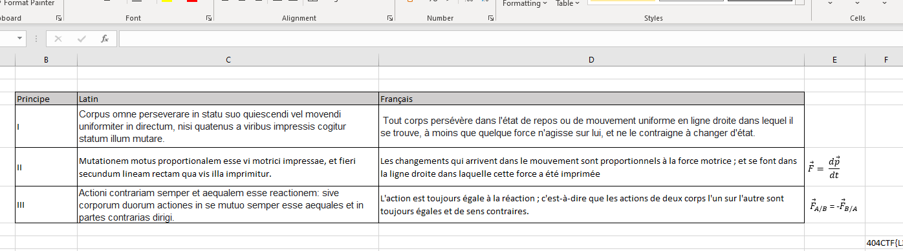
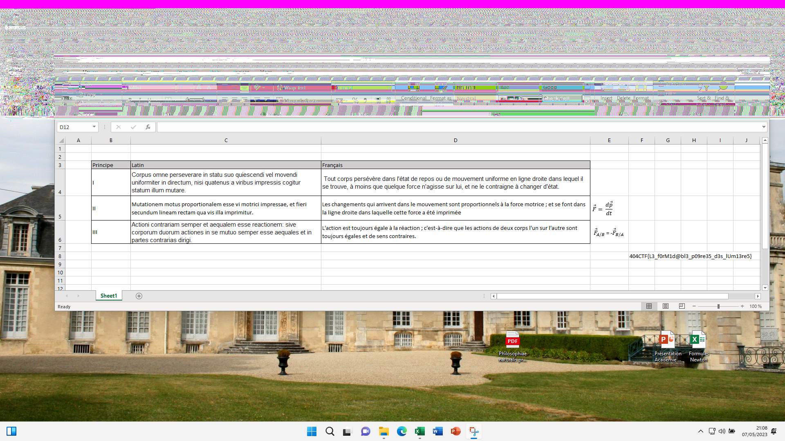

# Acropalypse


## Énoncé

En tendant l'oreille aux conversations du salon, votre attention est captée par l'une d'elle qui attire tout particulièrement votre curiosité. Là où les alentours dissertent à propos de procédés littéraires toujours plus avancés, celle-ci semble en effet plutôt porter sur la philosophie naturelle. Vous vous approchez, curieux d'en apprendre plus, lorsque la marquise du Châtelet, alors en pleine explication des travaux d'un certain Leibniz, s’interrompt et vous interpelle :

> Vous me voyez ravie de vous rencontrer ici ! Nous n'avons pas eu la chance d'être présentés, mais on m'a parlé de vous et l'on m'a assuré que vous étiez formidable lorsqu'il s’agissait de retrouver les choses perdues. Voyez, j'ai travaillé il y a peu sur un projet qui me tient à cœur, et j'ai bien peur d'avoir perdu le fruit de mon travail par un triste accident. Heureusement, j'avais échangé à ce sujet avec un ami proche, et il est bien possible que notre correspondance est gardé la trace d'une note de bas de page que je souhaiterais tout particulièrement retrouver. Auriez vous l’amabilité de m'assister dans ma mésaventure ?

Auteur : `Smyler#7078`

## Résolution

Le fichier donné, `backup.pst`, est une sauvegarde Outlook. Il peut être ouvert directement avec Outlook,
ou avec `pffexport` (paquet `pff-tools` sur Ubuntu).

On trouve un seul email dans les éléments envoyés, il contient une pièce jointe, `Capture d’écran 2023-05-07 210840.png`.



Cette dernière est une capture d'écran prise sur un Windows 11 vulnérable à [Acropalypse](https://twitter.com/David3141593/status/1638222624084951040).
On aperçoit le début du flag qui a été crop. On peut aller récupérer le script d'origine pour les smartphones,
et l'adapter pour Windows 11, en changeant la logique pour des pixel RGBA plutôt que RGB. Voir `acropalypse.py`. Il faut ensuite deviner la taille de l'écran.
On peut tenter plusieurs résolutions classiques, la bonne est `1920x1280`.

```shell
python acropalypse.py 1920 1080 "backup.pst.export/1_Capture d’écran 2023-05-07 210840.png" out.png
```


