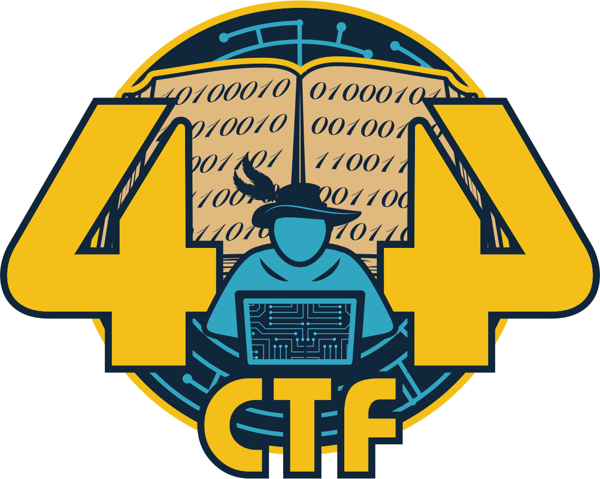

  
  <h1 style=>404 CTF - Édition 2023</h1>
  

    Ce dépôt contient les codes sources des challenges de l'édition 2023 du 404 CTF, éventuellement accompagnés de leurs solutions ou d'autres ressources complémentaires. Les challenges de l'édition 2022 sont trouvables sur <a href="https://github.com/HackademINT/404CTF-2022">ce dépôt</a>.
  

  
<i>
    This repository contains the source code for the challenges of the 2023 edition of the 404 CTF, often with their solutions or additional resources. Challenges for the 2022 edition can be found in <a href="https://github.com/HackademINT/404CTF-2022">the following repository</a>.
  </i>

## Le 404 CTF

Le 404 CTF est la plus grande compétition de cybersécurité française. Elle est coorganisée par [la DGSE](https://www.dgse.gouv.fr), [Télécom SudParis](https://www.telecom-sudparis.eu), [HackademINT](https://www.hackademint.org), [OVHcloud](https://www.ovhcloud.com) et [Viva Technology](https://vivatechnology.com). L'édition 2023 s'est tenue du 12 main au 4 juin 2023 et a rassemblé près de 3000 participants autours de la centaine de challenges conçus par HackademINT. En savoir plus sur [le site du 404 CTF](https://www.404ctf.fr).

*The 404 CTF is France's largest cybersecurity competition. It is organized jointly by the [DGSE](https://www.dgse.gouv.fr), [Télécom SudParis](https://www.telecom-sudparis.eu), [HackademINT](https://www.hackademint.org), [OVHcloud](https://www.ovhcloud.com) and [Viva Technology](https://vivatechnology.com). The 2023 edition took place from May 12 to June 4 2023 and gathered about 3000 competitors around 100 challenges designed by HackademINT. Learn more on [the 404 CTF's website](https://www.404ctf.fr).*

## Catégories

- 🔎 [Analyse forensique](AnalyseForensique) - *Forensic analysis*
- ☁️ [Cloud](Cloud)
- 🔐 [Cryptanalyse](Cryptanalyse) - *Cryptanalysis*
- ☎️ [Divers](Divers) - *Miscellaneous*
- ⚙️ [Exploitation de binaires](ExploitationDeBinaires) - *Binary exploitation* (Pwn)
- 🧠 [Intelligence Artificielle](IntelligenceArtificielle) - *Artificial Intelligence* (IA)
- 🖥️ [Programmation](Programmation) - *Programming*
- 📡 [Radio-Fréquences](RadioFrequences) - *Radio Frequencies*
- 🌎 [Renseignement en sources ouvertes](RenseignementEnSourcesOuvertes) - *Open Source Intelligence* (OSINT)
- 🔧 [Rétro-ingénierie](RetroIngenierie) - *Reverse Engineering*
- 🌐 [Stéganographie](Steganographie) - *Steganography*
- 📟 [Sécurité matérielle](SecuriteMaterielle) - *Hardware*
- 🌐 [Web](Web)
- ⛓️ [Web3](Web3)

## Licence

À l'exception des logos et des noms des partenaires et du CTF, et à moins qu'une autre licence soit explicitée dans le répertoire correspondant, le contenu de ce dépôt est sous [licence MIT](LICENSE).

*With the exception of the logos and names of the CTF's organizers and of the CTF, and unless another license is stated in the corresponding directory, the content of the repository is provided under the [MIT license](LICENSE).*
