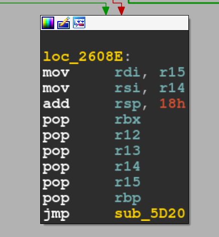
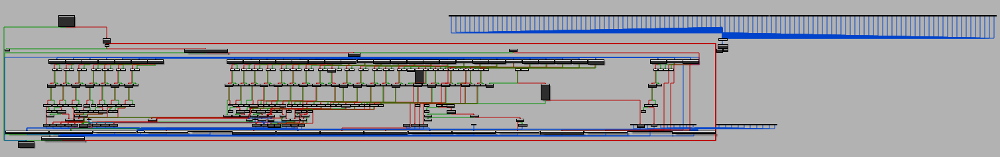
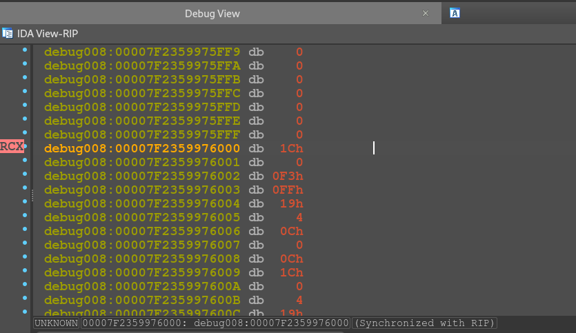

# Le Jour du mange poney

Il s'agit d'un crackme. Donc il faut retrouver le mot de passe.

# Fichiers

`asm.py`, petit assembleur en python pour mon assembleur custom.

`build.sh`, permet da lancer la toolchain de build. Vous avez besoin de ponylang et Jinja2.

`create-pony.py`, permet de générer le fichier `main.pony` à partir de la template Jinja.

`main.pony`, source ponylang.

`main.pony.j2`, template Jinja2 du code source.

`prgm.pasm`, le programme de check du mot de passe, en pony-asm.

## Solution

Le programme a été codé en ponylang. Il y a donc des particularités à la décompilation.
On peut assez vite se rendre compte qu'il s'agit d'une VM.

Dans un binaire ponylang le plus simple est d'aller dans la fonction `Main_Dispatch`. Puis `sub_7060` (dans IDA).

En scrollant on skip le setup et on se retrouve vers le call de la VM en elle même. Il s'agit du call vers `sub_5D20`. 



On arrive alors vers le coeur du programme. Là où il faut passer du temps à reverse les opcodes 1 par 1.

Je crois bien que c'est plus simple en restant au niveau du CFG.
Voici un appercu dans IDA : 



Je ne vais pas détailler tous les opcodes ici mais les fonctionalités principales de la VM sont : 

 - Arithmétique de base sur des registres 64 bit
 - Jumps en tous genres avec comparaisons. Les adresses sont scindées en 2 (un byte high et un byte low)
 - Une stack
 - Un accès à une zone mémoire en rw-


Le programme interne peut se retrouver en dynamique par exemple : ici dans IDA : 



Une fois le programme interne reverse et désassemblé. Il ressemble a ceci (en considérant que vous avez replacé des labels pour la visibilité, ainsi que des noms pour les registres)

```
entrypoint:
    call main
    end

rec:
    jei tos 12 nextrec
    call rec
nextrec:
    jei tos 12 l12
    jei tos 11 l11
    jei tos 10 l10
    jei tos 9 l9
    jei tos 8 l8
    jei tos 7 l7
    jei tos 6 l6
    jei tos 5 l5
    jei tos 4 l4
    jei tos 3 l3
    jmp finirec

l11:
    push r7
    movi r7 16
    readm r7 r7
    pop r1
    xor r1 r7
    jnei r1 33 bad
    jmp finirec
l5:
    movi r1 10
    readm r1 r1
    addi r1 2
    jnei r1 112 bad
    jmp finirec
l12:
    movi r7 17
    readm r7 r7
    xori r7 44
    jnei r7 111 bad
    jmp finirec
l4:
    movi r3 9
    readm r3 r3
    xor r3 r5
    jnei r3 66 bad
    jmp finirec
l9:
    movi r1 14
    readm r1 r1
    sub r5 r1
    jnei r5 114 bad
    jmp finirec
l10:
    movi r5 15
    readm r5 r5
    add r5 r1
    xor r5 r7
    jnei r5 216 bad
    jmp finirec
l6:
    movi r2 11
    readm r2 r2
    add r2 r5
    xor r2 r1
    jnei r2 71 bad
    jmp finirec
l8:
    movi r1 13
    readm r1 r1
    xor r1 r5
    jnei r1 82 bad
    jmp finirec
l7:
    movi r1 12
    readm r1 r1
    add r1 r5
    jnei r1 172 bad
    jmp finirec
l3:
    movi r2 8
    readm r2 r2
    add r2 r3
    jnei r2 146 bad

finirec:
    ret

main:
    xor r7 r7
    call len
    subi r0 32
    jnz r0 bad
    readm r0 r0
    call transfo1
    movi r1 140
    muli r1 100
    addi r1 42
    jne r0 r1 bad
    movi r0 1
    readm r0 r0
    movi r1 2
    readm r1 r1
    call transfo2
    jnei r0 105 bad
    jnei r1 85 bad
    movi r0 3
    movi r1 4
    movi r2 5
    movi r3 6
    readm r0 r0
    readm r1 r1
    readm r2 r2
    readm r3 r3
    call equa
    jnz r0 bad
    movi r0 7
    readm r0 r0
    call transfo1
    movi r1 91
    muli r1 100
    addi r1 20
    jne r0 r1 bad
    xor r0 r0
    call rec
    movi r0 18
    readm r0 r0
    call transfo1
    movi r1 135
    muli r1 100
    addi r1 72
    jne r0 r1 bad
    call multicouche
    movi r0 20
    movi r1 21
    readm r0 r0
    readm r1 r1
    call transfo3
    movi r2 200
    addi r2 68
    jnei r0 206 bad
    jne r1 r2 bad
    movi r0 22
    readm r0 r0
    call transfo1
    movi r1 13
    muli r1 100
    addi r1 32
    jne r0 r1 bad
    movi r0 23
    readm r0 r0
    call lng
    call equa2
    jmp good
    ret

bad:
    call pbad
    end

len:
    readm r1 r0
    jz r1 finilen
    addi r0 1
    jmp len
finilen:
    ret

good:
    call pgood
    end


lng:
    pop r1
    push r1
    xor r0 r1
    movi r1 4
    muli r1 100
    addi r1 95
    jne r0 r1 bad 
    ret

pbad:
    xor r0 r0
    movmi r0 78
    addi r0 1
    movmi r0 111
    addi r0 1
    movmi r0 110
    addi r0 1
    movmi r0 32
    addi r0 1
    movmi r0 59
    addi r0 1
    movmi r0 40
    addi r0 1
    movmi r0 0
    xor r0 r0
    out r0
    ret

equa:
    mov r4 r0
    xor r4 r1
    jnei r4 1 badequa
    mov r4 r2
    xor r4 r3
    jnei r4 120 badequa
    mov r4 r1
    xor r4 r3
    jnei r4 57 badequa
    mov r4 r0
    add r4 r2
    jnei r4 168 badequa
    mov r4 r0
    and r4 r3
    jnei r4 68 badequa
    movi r0 0
    ret 
badequa:
    movi r0 1
    ret

pgood:
    xor r0 r0
    movmi r0 89
    addi r0 1
    movmi r0 97
    addi r0 1
    movmi r0 121
    addi r0 1
    movmi r0 32
    addi r0 1
    movmi r0 33
    addi r0 1
    movmi r0 0
    xor r0 r0
    out r0
    ret

transfo2:
    pushi 26
    add r1 tos
    pop r2
    div r2 tos
    xor r0 r2
    xor r0 r1
    ret

transfo1:
    push r0
    mul r0 r0
    pop r1
    add r0 r1
    ret

multicouche:
    call multicouche2
    ret
multicouche2:
    call multicouche3
    ret
multicouche3:
    call multicouche4
    ret
multicouche4:
    call multicouche5
    ret
multicouche5:
    call multicouche6
    ret
multicouche6:
    call multicouche7
    ret
multicouche7:
    call multicouche8
    ret
multicouche8:
    call multicouche9
    ret
multicouche9:
    call multicouche10
    ret
multicouche10:
    call multicouche11
    ret
multicouche11:
    call multicouche12
    ret
multicouche12:
    call multicouche13
    ret
multicouche13:
    call multicouche14
    ret
multicouche14:
    call multicouche15
    ret
multicouche15:
    call multicouche16
    ret
multicouche16:
    call multicouche17
    ret
multicouche17:
    call multicouche18
    ret
multicouche18:
    call multicouche19
    ret
multicouche19:
    call multicouche20
    ret
multicouche20:
    call multicouche21
    ret
multicouche21:
    call multicouche22
    ret
multicouche22:
    call multicouche23
    ret
multicouche23:
    call multicouche24
    ret
multicouche24:
    call multicouche25
    ret
multicouche25:
    call multicouche26
    ret
multicouche26:
    call multicouche27
    ret
multicouche27:
    call multicouche28
    ret
multicouche28:
    call multicouche29
    ret
multicouche29:
    call multicouche30
    ret
multicouche30:
    call multicouche31
    ret
multicouche31:
    call multicouche32
    ret
multicouche32:
    call multicouche33
    ret
multicouche33:
    call multicouche34
    ret
multicouche34:
    call multicouche35
    ret
multicouche35:
    call multicouche36
    ret
multicouche36:
    call multicouche37
    ret
multicouche37:
    call multicouche38
    ret
multicouche38:
    call multicouche39
    ret

transfo3:
    push r0
    muli r0 2
    add r0 r1
    muli r1 2
    pop r2
    add r1 r2
    ret

multicouche39:
    call multicouche40
    ret
multicouche40:
    call multicouche41
    ret
multicouche41:
    call multicouche42
    ret
multicouche42:
    call multicouche43
    ret
multicouche43:
    call multicouche44
    ret
multicouche44:
    call multicouche45
    ret
multicouche45:
    call multicouche46
    ret
multicouche46:
    call multicouche47
    ret
multicouche47:
    call multicouche48
    ret
multicouche48:
    movi r0 19
    readm r0 r0
    jne r0 tos bad
    movi r3 240
    movmi r3 134
    ret

equa2:
    movi r3 240
    movi r0 24
    movi r1 26
    readm r0 r0
    readm r1 r1 
    readm r3 r3
    add r1 r0
    sub r1 r3
    jnei r1 70 bad
    muli r0 2
    movi r1 29
    readm r1 r1
    add r0 r1
    subi r0 100
    jnei r0 204 bad
    movi r0 28
    readm r0 r0
    movi r1 31
    readm r1 r1
    muli r0 3
    sub r0 r1
    jnei r0 171 bad
    movi r0 24
    movi r7 8
    xor r1 r1
innerloop:
    jz r7 finiequa2
    subi r7 1
    readm r2 r0
    add r1 r2
    addi r0 1
    jmp innerloop
finiequa2:
    movi r0 6
    muli r0 100
    addi r0 77
    jne r0 r1 bad
    movi r0 25
    movi r1 30
    readm r0 r0
    readm r1 r1
    muli r1 2
    add r0 r1
    jnei r0 212 bad
    movi r0 27
    movi r1 31
    readm r0 r0
    readm r1 r1
    muli r0 7
    muli r1 2
    sub r0 r1
    jnei r0 24 bad
    movi r0 29
    movi r1 28
    readm r0 r0
    readm r1 r1
    sub r0 r1
    jnei r0 3 bad
    movi r0 29
    movi r1 30
    readm r0 r0
    readm r1 r1
    sub r0 r1
    jnei r0 16 bad
    ret
```


Rien de très complexe mais pas mal de petites offuscations. Quelques équations à résoudre, et surtout beaucoup de calls de fonctions dans tous les sens.


Une fois tout reverse vous avez accès au seul mot de passe valide : `v1Rtu4L_P0ny: fuNCt10n$-g0e$_bRr`.