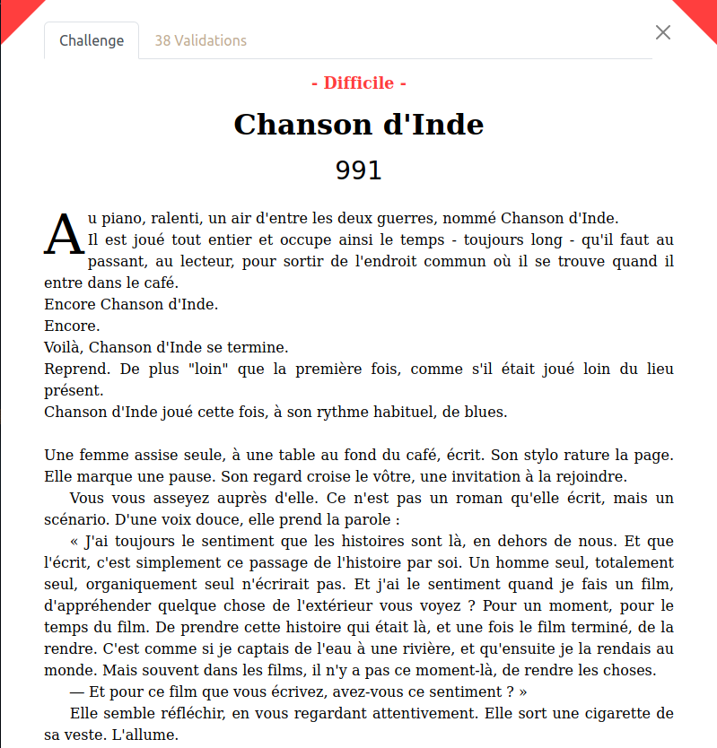
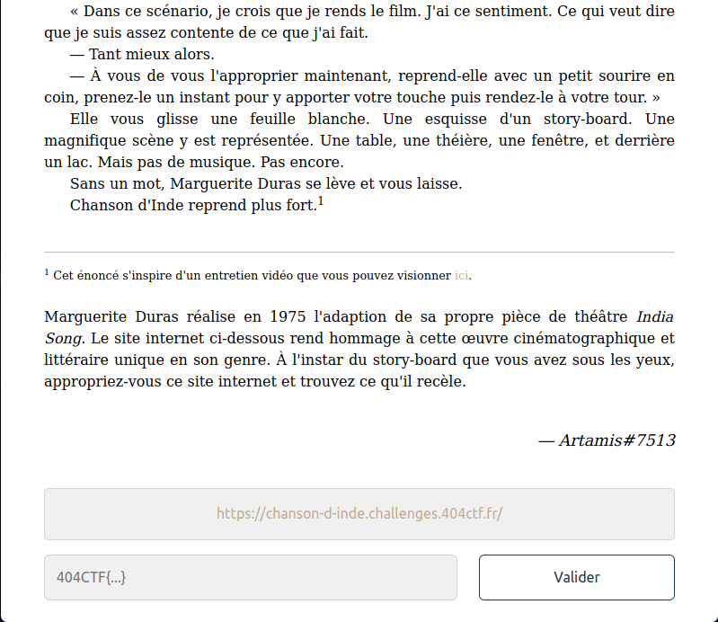

# Chanson d'Inde

**Catégorie** : Web \
**Auteur** : Artamis \
**Difficulté** : Difficile \
**Points à la fin du CTF** : 991 \
**Validations** : 38

Ce challenge met en oeuvre la [CVE-2022-29078](https://www.cvedetails.com/cve/CVE-2022-29078/) : une vulnérabilité du moteur de template EJS qui peut amener à une RCE. Après lecture du `robots.txt`, l'attaquant découvre un `CHANGELOG.md` qui laisse entendre que le package _ejs_ n'a pas été mis à jour depuis longtemps. Il faut ensuite adapter la POC de la CVE dans une requête POST et trouver un moyen de récupérer l'output des commandes que l'on exécute sur le serveur dans la réponse HTTP.

## Utilisation

Vous pouvez utiliser `docker` et `docker-compose` pour déployer une version locale de ce challenge sur votre machine.

Depuis le dossier courant, lancez :

```bash
docker-compose up -d --build
```

Le site est accessible en : https://127.0.0.1:3000 .

Pour arrêter son exécution, lancez :

```bash
docker-compose down
```

> **ATTENTION** : Ce challenge était déployé dans une infrastructure Kubernetes qui l'empêchait d'accéder au réseau à l'extérieur du cluster. Cela signifie qu'il était impossible d'obtenir un reverse shell, d'exécuter curl vers un endpoint extérieur etc... En local, le container a bien accès à internet et ne recrée donc pas les conditions réelles du challenge.

## Solution

Voir [WRITE-UP.md](./WRITE-UP.md).

## Énoncé

Au piano, ralenti, un air d'entre les deux guerres, nommé Chanson d'Inde.
Il est joué tout entier et occupe ainsi le temps - toujours long - qu'il faut au passant, au lecteur, pour sortir de l'endroit commun où il se trouve quand il entre dans le café.
Encore Chanson d'Inde.
Encore.
Voilà, Chanson d'Inde se termine.
Reprend. De plus "loin" que la première fois, comme s'il était joué loin du lieu présent.
Chanson d'Inde joué cette fois, à son rythme habituel, de blues.

Une femme assise seule, à une table au fond du café, écrit. Son stylo rature la page. Elle marque une pause. Son regard croise le vôtre, une invitation à la rejoindre.

Vous vous asseyez auprès d'elle. Ce n'est pas un roman qu'elle écrit, mais un scénario. D'une voix douce, elle prend la parole :

« J'ai toujours le sentiment que les histoires sont là, en dehors de nous. Et que l'écrit, c'est simplement ce passage de l'histoire par soi. Un homme seul, totalement seul, organiquement seul n'écrirait pas. Et j'ai le sentiment quand je fais un film, d'appréhender quelque chose de l'extérieur vous voyez ? Pour un moment, pour le temps du film. De prendre cette histoire qui était là, et une fois le film terminé, de la rendre. C'est comme si je captais de l'eau à une rivière, et qu'ensuite je la rendais au monde. Mais souvent dans les films, il n'y a pas ce moment-là, de rendre les choses.

— Et pour ce film que vous écrivez, avez-vous ce sentiment ? »

Elle semble réfléchir, en vous regardant attentivement. Elle sort une cigarette de sa veste. L'allume.

« Dans ce scénario, je crois que je rends le film. J'ai ce sentiment. Ce qui veut dire que je suis assez contente de ce que j'ai fait.

— Tant mieux alors.

— À vous de vous l'approprier maintenant, reprend-elle avec un petit sourire en coin, prenez-le un instant pour y apporter votre touche puis rendez-le à votre tour. »

Elle vous glisse une feuille blanche. Une esquisse d'un story-board. Une magnifique scène y est représentée. Une table, une théière, une fenêtre, et derrière un lac. Mais pas de musique. Pas encore.

Sans un mot, Marguerite Duras se lève et vous laisse.

Chanson d'Inde reprend plus fort.

---

_Cet énoncé s'inspire d'un entretien vidéo que vous pouvez visionner [ici](https://www.ina.fr/ina-eclaire-actu/video/i04259990/marguerite-duras-a-propos-de-india-song)._

Marguerite Duras réalise en 1975 l'adaption de sa propre pièce de théâtre India Song. Le site internet ci-dessous rend hommage à cette œuvre cinématographique et littéraire unique en son genre. À l'instar du story-board que vous avez sous les yeux, appropriez-vous ce site internet et trouvez ce qu'il recèle.

### Liens et fichiers

**Lien** : `https://chanson-d-inde.challenges.404ctf.fr/`

### Screenshot




### CTFd

```md
Au piano, ralenti, un air d'entre les deux guerres, nommé Chanson d'Inde.
<br>
Il est joué tout entier et occupe ainsi le temps - toujours long - qu'il faut au passant, au lecteur, pour sortir de l'endroit commun où il se trouve quand il entre dans le café.
<br>
Encore Chanson d'Inde.
<br>
Encore.
<br>
Voilà, Chanson d'Inde se termine.
<br>
Reprend. De plus "loin" que la première fois, comme s'il était joué loin du lieu présent.
<br>
Chanson d'Inde joué cette fois, à son rythme habituel, de blues.

<p class="space">&nbsp;</p>

Une femme assise seule, à une table au fond du café, écrit. Son stylo rature la page. Elle marque une pause. Son regard croise le vôtre, une invitation à la rejoindre.

Vous vous asseyez auprès d'elle. Ce n'est pas un roman qu'elle écrit, mais un scénario. D'une voix douce, elle prend la parole :

« J'ai toujours le sentiment que les histoires sont là, en dehors de nous. Et que l'écrit, c'est simplement ce passage de l'histoire par soi. Un homme seul, totalement seul, organiquement seul n'écrirait pas. Et j'ai le sentiment quand je fais un film, d'appréhender quelque chose de l'extérieur vous voyez ? Pour un moment, pour le temps du film. De prendre cette histoire qui était là, et une fois le film terminé, de la rendre. C'est comme si je captais de l'eau à une rivière, et qu'ensuite je la rendais au monde. Mais souvent dans les films, il n'y a pas ce moment-là, de rendre les choses.

— Et pour ce film que vous écrivez, avez-vous ce sentiment ? »

Elle semble réfléchir, en vous regardant attentivement. Elle sort une cigarette de sa veste. L'allume.

« Dans ce scénario, je crois que je rends le film. J'ai ce sentiment. Ce qui veut dire que je suis assez contente de ce que j'ai fait.

— Tant mieux alors.

— À vous de vous l'approprier maintenant, reprend-elle avec un petit sourire en coin, prenez-le un instant pour y apporter votre touche puis rendez-le à votre tour. »

Elle vous glisse une feuille blanche. Une esquisse d'un story-board. Une magnifique scène y est représentée. Une table, une théière, une fenêtre, et derrière un lac. Mais pas de musique. Pas encore.

Sans un mot, Marguerite Duras se lève et vous laisse.

Chanson d'Inde reprend plus fort.<sup>1</sup>

<p class="space">&nbsp;</p>

---

<div class="bottom-page" style="font-size: 0.8em">
	<p class="first"><sup>1</sup> Cet énoncé s'inspire d'un entretien vidéo que vous pouvez visionner <a href="https://www.ina.fr/ina-eclaire-actu/video/i04259990/marguerite-duras-a-propos-de-india-song" target="_blank">ici</a>.</p>
</div>

<p class="space">&nbsp;</p>

Marguerite Duras réalise en 1975 l'adaption de sa propre pièce de théâtre _India Song_. Le site internet ci-dessous rend hommage à cette œuvre cinématographique et littéraire unique en son genre. À l'instar du story-board que vous avez sous les yeux, appropriez-vous ce site internet et trouvez ce qu'il recèle.

<p class="space">&nbsp;</p>

<div class="author">Artamis#7513</div>

<p class="space">&nbsp;</p>
```
