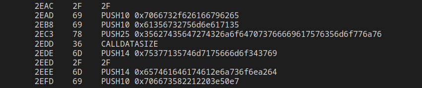
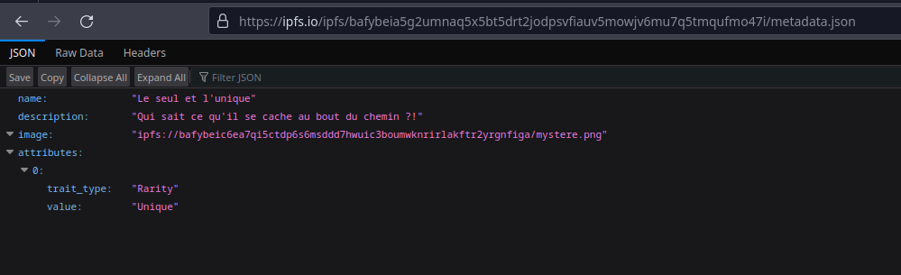
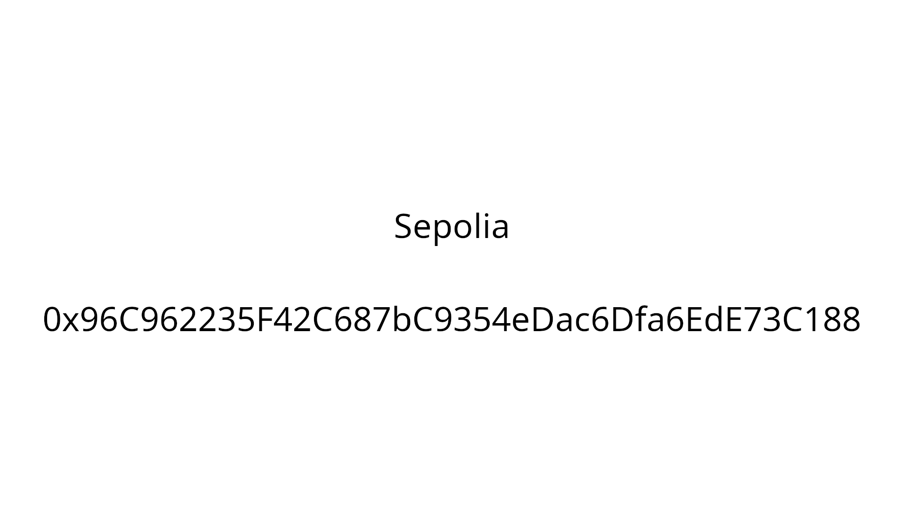
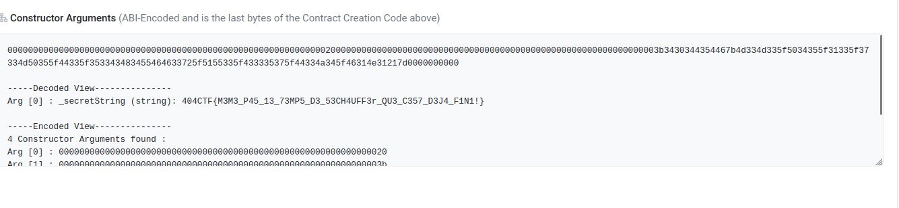

# Résolution

Vous disposez d'un fichier contenant le [bytecode EVM d'un smart contract](../memorandum.txt).

Il faut ensuite décompiler et/ou désassembler le bytecode EVM pour comprendre de quoi il en retourne.
Pour cela vous pouvez utiliser des outils comme [celui-ci](https://ethervm.io/decompile) ou encore [celui-là](https://library.dedaub.com/decompile).

Après quelques observations, on peut se rendre compte que le bytecode du smart contract correspond à celui d'un NFT. 
On cherche les métadonnées du NFT :

En reconstituant le CID IPFS trouvé dans le bytecode, on peut accéder aux [métadonnées du NFT](https://ipfs.io/ipfs/bafybeia5g2umnaq5x5bt5drt2jodpsvfiauv5mowjv6mu7q5tmqufmo47i/metadata.json) :

On voit ensuite un CID IPFS qui correpond à l'image censée représenter le NFT. 
De nouveau on suit le lien et on tombe sur [une image](https://ipfs.io/ipfs/bafybeic6ea7qi5ctdp6s6msddd7hwuic3boumwknrirlakftr2yrgnfiga/mystere.png) :

En faisant une simple recherche Google ou alors en ayant quelques connaissances sur Ethereum, on peut se rendre compte que Sepolia est un réseau de test Ethereum.

En utilisant un explorateur de blocs comme [Etherscan](https://sepolia.etherscan.io/), on peut retrouver le smart contract censé contenir le mot de passe [ici](https://sepolia.etherscan.io/address/0x96C962235F42C687bC9354eDac6Dfa6EdE73C188#code).

Il ne reste plus qu'à récupérer le mot de passe en retrouvant l'argument du constructeur, la fonction givePassword ou encore en regardant directement dans le storage (rien n'est privé sur Ethereum) :

